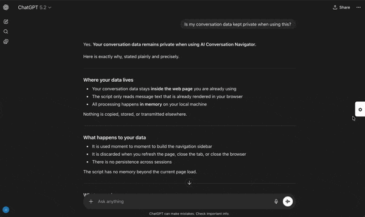
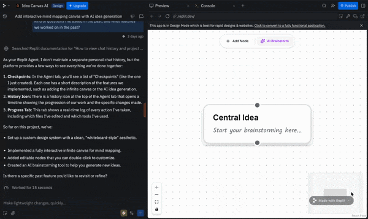

# AI Conversation Navigator

A browser userscript that adds an orbital navigation system to long AI chat conversations. Quickly jump to any of your previous questions with a single click.

If you are like me, I just go on and on with chat ai, learning one thing and it spurs another questions. Which is good in a sense I am constantly learning, but it turns out to be one very long conversation script. I know that the models have to compress and save it to memory and I should start another chat to save token consumption, but I just continually ask in chat and it kinda shows the flow of thought and learning. I just like it this way, what can I say. So it becomes troublesome trying to go back to chat ai's previous answers, I have to play the guessing game of "I think you said something about this here somewhere...". I thought soon OpenAI or Anthropic would add simple feature on the scroll bar to show my previous questions and I can "jump" to that part of conversation, but it hasn't came out yet, so I decided to make my own, for now. 

I still think they should make a feature like this for each of their company, which will show their different design philosophies and many other features that could come with this concept. For example, while testing I just found out that Grok does have feature similar to this, with modern line design and summary of the question popping up. Exactly what I'm talking about, like I still wonder why other companies are not implementing it. I think its necessary design, especially for people who have prolonged conversation with those ai models and interact with it daily. I'll still be building my product to be used all across different web browsers and ai models, but I do think in near future that each company should and will come out with their own feature for this, and like I wouldn't be mad getting replaced. I'd be excited to see how each company has different philosophies and approach to thinking how us humans can maximize utility and efficiency with those ai models.

But until then, I'll just keep making, building, and improving this project. Stay tuned.


## Supported Platforms

### AI Chatbots



| Platform | Icon | Color | Status |
|----------|------|-------|--------|
| [Claude](https://claude.ai) | ✳ | 🟠 Orange | ✅ Supported |
| [ChatGPT](https://chatgpt.com) | ⏣ | ⚪ White | ✅ Supported |
| [Grok](https://grok.com) | X | 🔴 Red | ✅ Supported |
| [Gemini](https://gemini.google.com) | ✦ | 🔵 Blue | ✅ Supported |
| [Perplexity](https://perplexity.ai) | ✳ | 🩵 Teal | ✅ Supported |

### Coding Agents (Web)

| Platform | Icon | Color | Status |
|----------|------|-------|--------|
| [Claude Code](https://claude.ai/code) | ✳ | 🟠 Orange | ✅ Supported |
| [Codex](https://chatgpt.com/codex) | ⏣ | ⚪ White | ✅ Supported |

I use those coding agents mostly in terminal CLI, and I find them incredibly effective there too. Or inside the terminal of VS fork IDEs, like Cursor or Antigravity. Claude code on web is only a research preview, and codex even has a separate app for mac OS. However, I do think web version also has its merits and I do use them too, so I thought I'd add support on anyway.

### AI App-Builder Platforms



| Platform | Icon | Color | Button Style | Status |
|----------|------|-------|-------------|--------|
| [Bolt.new](https://bolt.new) | ⚡ | 🩵 Sky Blue | Ghost Notch (left-chat) | ✅ Beta |
| [Lovable](https://lovable.dev) | ♥ | 🟣 Violet | Ghost Notch (left-chat) | ✅ Beta |
| [Replit](https://replit.com) | ⠕ | 🟠 Red-Orange | Ghost Notch (left-chat) | ✅ Beta |
| [V0](https://v0.app) | ▽ | ⚪ White | Ghost Notch (left-chat) | ✅ Beta |
| [Base44](https://app.base44.com) | ⬢ | 🟣 Indigo | Ghost Notch (left-chat) | ✅ Beta |
| [Emergent](https://app.emergent.sh) | e | 🟢 Emerald | Ghost Notch (left-chat) | ✅ Beta |
| [Firebase Studio](https://studio.firebase.google.com) | ✦ | 🟠 Dark Tangerine | Standard (right-edge) | ✅ Beta |

> **Beta Notice:** The initial support for these app-builder platforms was developed using **mock DOM testing** — we built replica HTML pages based on open-source forks and research, then validated our selectors against those replicas with automated Playwright tests (see [TESTING.md](TESTING.md)). Later, we created free accounts on each platform to test against the live sites and refine the selectors they use for the questions we ask. This means the selectors are informed by real DOM inspection, but these platforms update frequently and may change their HTML structure at any time. **If you try it and run into problems, please [open an issue](https://github.com/JoonJ14/ai-conversation-navigator/issues) describing what you see.** Your real-world feedback is exactly what will help us fix selectors and make this work well. We genuinely welcome it.

> **Note on icons:** Each platform's button uses a common Unicode symbol that *evokes* the platform's branding rather than the actual company logo. This avoids any trademark or copyright concerns. See [Icon Choices](#icon-choices) for details.

## Supported Web Browsers

Chrome, Firefox, Safari, Edge


## Installation : Trust me, it's really not much.

### Step 1: Install a Userscript Manager

Install one of these extensions for your browser:

- **Chrome/Edge**: [Tampermonkey](https://www.tampermonkey.net/) Download the first one you see for Chrome 120+
- **Firefox**: [Tampermonkey](https://www.tampermonkey.net/) (recommended) or [Greasemonkey](https://www.greasespot.net/) (may work but untested)
- **Safari**: [Userscripts](https://apps.apple.com/us/app/userscripts/id1463298887) (You can use tampermonkey with Safari too, but unlike Chrome and Firefox, you have to buy tampermonkey in app store for $2.99. Userscript is free and our code works with userscript, so you don't have to pay, unless you already bought it.)

### Step 2: Browser-Specific Setup

Some browsers need extra configuration before userscripts will work. **Find your browser below**, follow those steps, then move on to [Step 3](#step-3-install-the-script).

> **Firefox users:** No extra setup needed — skip straight to [Step 3](#step-3-install-the-script).

<details>
<summary><strong>Chrome</strong></summary>

Chrome requires **Developer Mode** enabled for Tampermonkey to run userscripts:
1. Make sure you downloaded tampermonkey on Step 1
2. Go to `chrome://extensions/` or press the puzzle button right next to the URL bar, and click "manage extensions"
3. Toggle **"Developer mode"** ON (top-right corner)
4. Find **Tampermonkey** → click **Details**
5. Scroll down and toggle **"Allow User Scripts"** ON
6. Click **"Relaunch"** if Chrome prompts you or refresh 
7. Go to Step 3

</details>

<details>
<summary><strong>Edge</strong></summary>

Edge is built on the same engine as Chrome, so the setup is very similar.
1. Make sure you downloaded tampermonkey on Step 1
2. Go to `edge://extensions/` or press the puzzle button right next to the URL bar, and click "manage extensions"
3. Toggle **"Developer mode"** ON (mid-left side of the screen)
4. Find **Tampermonkey** → click **Details**
5. Scroll down and toggle **"Allow User Scripts"** ON
6. Click **"Relaunch"**  if Edge prompts you or refresh 
7. Go to Step 3

</details>

<details>
<summary><strong>Safari</strong></summary>

After installing [Userscripts](https://apps.apple.com/us/app/userscripts/id1463298887), Safari will ask which websites the extension can access.

**Recommended: Per-Site Permissions (default)**

Grant access only to the AI chat sites you use:

1. Open Safari → Settings → Extensions → Userscripts
2. Under "Permissions", set to **"Ask for Each Website"** (this is the default)
3. Visit each AI site you use ([claude.ai](https://claude.ai), [chatgpt.com](https://chatgpt.com), [grok.com](https://grok.com), [gemini.google.com](https://gemini.google.com), [perplexity.ai](https://perplexity.ai), [bolt.new](https://bolt.new), [lovable.dev](https://lovable.dev), [replit.com](https://replit.com), [v0.app](https://v0.app), and others from the [Supported Platforms](#supported-platforms) list)
4. When Safari asks, click **"Always Allow on This Website"**
5. You can set **"Deny"** for all the other sites after you have added all the AI sites you use in 3. If not, userscript will keep asking for any other new website you visit, which can be annoying

This way the extension only has access to the specific sites you approve.

**Alternative: Allow on All Websites**

If you prefer not to approve each site individually, you can set the extension to **"Allow on All Websites"** — and it is still safe. Here's why:

1. **`@match` rules are enforced by the extension** — The script's metadata declares exactly which URLs it should run on (`claude.ai`, `chatgpt.com`, `grok.com`, `gemini.google.com`). Userscripts.app reads these `@match` patterns and *only injects the script on those matching pages*, regardless of the Safari permission level.
2. **The script itself only activates on recognized sites** — Even if somehow injected elsewhere, the code detects which platform it's on and does nothing if the site isn't one of the supported platforms.
3. **No data leaves your browser** — The script is purely local DOM manipulation. It doesn't make network requests, collect data, or communicate with any external server.
4. **Fully open source** — You can read every line of the script to verify all of the above.

So "Allow on All Websites" effectively behaves the same as per-site permissions for this script. But per-site is still the recommended default because it's good security hygiene for *any* extension.

**Important quirk:** Unlike Tampermonkey, Userscripts.app does not auto-detect external file changes. If you manually edit or update the `.user.js` file outside of Safari, you must **open the Userscripts extension popup once** for the changes to take effect.

</details>

### Step 3: Install the Script

#### Option 1: Direct Install
Click here to install: [ai-conversation-navigator.user.js](../../raw/main/ai-conversation-navigator.user.js)

#### Option 2: Manual Install
1. Open your userscript manager's dashboard
2. Create a new script
3. Copy and paste the contents of `ai-conversation-navigator.user.js`
4. Save the script


## Features

- **🪐 Orbital Button Cluster** — Six feature dots arranged in a compact orbital cluster at the edge of the screen. Hover to reveal; each dot opens its own panel. For app-builder platforms, the cluster anchors to the chat/workspace divider.
- **3 Display Modes** — Switch between **Show All** (all six dots at equal brightness), **Arc** (polygon arc with scroll-driven focus), and **Wheel** (conveyor belt with Navigate always highlighted). Mode preference is saved across sessions.
- **🎯 Navigate Panel** — Lists all your questions in the conversation with smart summaries. Click any entry to scroll directly to it and briefly highlight it.
- **🔍 Search Panel** — Type a keyword to filter your questions instantly. Narrows the question list in real time.
- **🔖 Bookmarks Panel** — Bookmark specific messages for quick return. Bookmarks persist across page reloads and script updates via GM storage.
- **Σ Summary Panel** — Auto-generates a summary of the conversation on panel open.
- **↗ Export Panel** — Exports the full conversation as a Markdown `.md` file.
- **⚙ Settings Panel** — Choose your display mode (Show All / Arc / Wheel) and scroll direction. Settings persist via localStorage.
- **📝 Smart Summaries** — Automatically extracts the key part of each question for the navigation list
- **🎨 Platform-Specific Themes** — Accent colors match each platform's branding (Claude orange, ChatGPT white, Grok red, Gemini blue, Perplexity teal)
- **✨ Visual Feedback** — Briefly highlights the message when you navigate to it
- **🛡️ SPA-Resilient** — DOM Guardian, SPA navigation hooks, and periodic health checks keep the UI alive through aggressive re-rendering (Gemini, Bolt, Lovable, Replit, V0, Base44, Emergent, Firebase Studio, Perplexity)
- **📊 Context Window Bar** — Claude: exact token count via SSE interception, labeled `(exact)` or `(last known)`. Non-Claude: turn dots and compaction prediction
- **💬 /Commands** — Typing `/commandname` in the chat input opens the command palette pre-filtered; updates live as you type
- **🌐 i18n** — Korean language support; all labels update live on language switch without page reload
- **📈 Plan Usage** — Fetches Claude plan utilization (session/weekly) and displays as progress bars in the Navigate panel


## Usage

1. Go to any supported AI chat platform
2. Look for the orbital cluster of dots:
   - **AI chatbots & Firebase Studio:** Cluster appears at the **bottom-right** of the screen
   - **App builders (Bolt, Lovable, Replit, V0, Base44, Emergent):** Cluster anchors to the **chat/workspace boundary**
3. Hover over the cluster to reveal the six feature dots
4. Click any dot to open its panel — the **Navigate** dot (✳) opens the question list
5. Click any question to jump to that part of the conversation
6. Use the **Settings** dot (⚙) to switch between display modes (Show All / Arc / Wheel)

## How It Works

The script injects an orbital button cluster into AI chat pages. It scans the page for your messages using platform-specific CSS selectors defined in the `PLATFORMS` registry:

| Platform | Selector |
|----------|----------|
| Claude | `[data-testid="user-human-turn"]` |
| Claude Code | `div.bg-bg-200.rounded-lg` + fallback chain |
| ChatGPT | `[data-message-author-role="user"]` |
| Codex Web | `div.self-end.bg-token-bg-tertiary` |
| Grok | `div.message-bubble` |
| Gemini | `div.query-text` |
| Perplexity | `.group\/query` (Tailwind group variant) |
| Bolt.new | `[data-message-id]` + `self-end` filter + fallback chain |
| Lovable | `div[role="log"] .justify-end` + fallback chain |
| Replit | `[data-cy="user-message"]` (Cypress attribute, one per message) |
| V0 | `[data-testid="message"]` + `origin-right`/`items-end` filter |
| Base44 | `[id^="message-"]` + `.justify-end` filter |
| Emergent | `[data-testid^="user-message"]` |
| Firebase Studio | `[class*="_isUser_"]` (CSS Modules partial match) |

## Icon Choices

Each platform's toggle button uses a Unicode symbol chosen to suggest the platform's visual identity without using actual trademarked logos:

| Platform | Icon | Why |
|----------|------|-----|
| Claude | ✳ (eight-spoked asterisk) | Evokes Anthropic's starburst logo shape |
| ChatGPT | ⏣ (benzene ring) | Evokes OpenAI's hexagonal knot logo |
| Grok | X | Represents xAI / X branding |
| Gemini | ✦ (four-pointed star) | Evokes Gemini's sparkle motif |
| Perplexity | ✳ (eight-spoked asterisk) | Same as Claude with text-presentation selector (`\uFE0E`) to prevent emoji rendering on Chrome/Mac |
| Bolt.new | ⚡ (high voltage) | Evokes "Bolt" lightning branding |
| Lovable | ♥ (heart suit) | Evokes Lovable's heart logo |
| Replit | ⠕ (Braille dots-135) | Community-adopted symbol for Replit's three-dot prompt logo |
| V0 | ▽ (inverted triangle) | Evokes Vercel's triangle/delta logo |
| Base44 | ⬢ (black hexagon) | Evokes a modular building block |
| Emergent | e (lowercase letter) | Emergent brand initial |
| Firebase Studio | ✦ (four-pointed star) | Same as Gemini — Firebase Studio runs Gemini under the hood, with dark tangerine color theme |

These are standard Unicode characters, not proprietary artwork, so there are no trademark, copyright, or licensing concerns.

## Troubleshooting

See [TROUBLESHOOTING.md](TROUBLESHOOTING.md) for platform-specific issues and solutions.

### Script not appearing?
- Make sure the userscript manager is enabled
- **Chrome users:** Enable **Developer Mode** in `chrome://extensions/`, then find Tampermonkey → Details → enable **"Allow User Scripts"**, then **relaunch Chrome**
- **Edge users:** Same as Chrome, but go to `edge://extensions/` instead. Enable **Developer Mode**, then find Tampermonkey → Details → enable **"Allow User Scripts"**, then **relaunch Edge**
- **Safari users:** Make sure you've granted Userscripts permission for the site (see [Step 2: Browser-Specific Setup](#step-2-browser-specific-setup) → Safari). If you edited the script file externally, open the Userscripts extension popup once to reload changes.
- Try hard-refreshing the page (Ctrl+Shift+R / Cmd+Shift+R)

### Quick Fixes
- **Messages not detected?** — The platform may have updated its HTML. Try clicking ↻ Refresh in the panel, or open an issue.
- **Gemini button broken on Chrome?** — Make sure you're on v5.0+. Earlier versions used `innerHTML` which is blocked by Gemini's Trusted Types CSP.

## Contributing

Found a bug or want to add a feature? Contributions are welcome!

1. Fork this repository
2. Create a feature branch (`git checkout -b feature/amazing-feature`)
3. Commit your changes (`git commit -m 'Add amazing feature'`)
4. Push to the branch (`git push origin feature/amazing-feature`)
5. Open a Pull Request

### Adding Support for New Platforms

To add a new AI platform:

**In the userscript (`ai-conversation-navigator.user.js`):**

1. Add the site URL to `@match` in the userscript header
2. Add ONE entry to the `PLATFORMS` registry at the top of the file — this single object defines detection, theme, icon, layout, selectors, and `getUserMessages()` logic all in one place

```javascript
newsite: {
    id: 'newsite',
    title: 'NewSite',
    match: function (host) { return host.includes('newsite.com'); },
    theme: { accent: '#color', accentHover: '#darker', accentLight: 'rgba(...)', textColor: 'white', toggleBorder: 'none', numberColor: null },
    icon: '★',
    layout: 'standard',        // or 'left-chat' for split-panel sites
    virtualScroll: false,
    spa: true,                 // if it aggressively re-renders the DOM
    scrollbarOffset: 0,
    boundarySelectors: null,   // for left-chat: CSS selectors for chat boundary detection
    boundaryStrategy: null,    // 'walk-up' or 'virtuoso'
    pathGuard: null,           // optional function(path) to restrict to certain URLs
    initGuards: [],
    retryDelays: [],
    textCleanup: [{ regex: /^You said\s*/i, replace: '' }],
    textExtractor: null,
    getUserMessages: function () {
        // Return NodeList or Array of user message DOM elements
        return document.querySelectorAll('[data-role="user"]');
    },
},
```

That's it — nothing else to touch in the userscript.

**In the test suite and docs:**

3. Create a mock HTML test page in `tests/mock-pages/` matching the real DOM structure
4. Add platform config to `PLATFORMS` array in `tests/test-all-platforms.js`
5. Add the real DOM structure to `DOM-REFERENCE.md`
6. Update the platform tables in `README.md` and `ROADMAP.md`

See [TESTING.md](TESTING.md) § "Step-by-Step: Adding a New Platform" for detailed instructions on mock pages and test configuration.

## Privacy & Safety

**Does this script collect any of my data or send it to external servers?**

No. The script makes zero network requests. It doesn't phone home, track usage, or send anything anywhere. Everything runs 100% locally in your browser. You can verify this yourself — the script's `@grant` declarations are `GM_addStyle` (CSS injection), `GM_getValue`/`GM_setValue` (bookmark and context-cache persistence), `GM_xmlhttpRequest` (Claude plan usage fetch), and `unsafeWindow` (SSE interception for Claude context tracking). None of these are used to exfiltrate data; there are no calls to send data to any external server.

**Can this script see my other browser tabs or passwords?**

No. The script only runs on the specific AI chat sites listed in [Supported Platforms](#supported-platforms) and has no access to your other browser tabs, browsing history, or saved passwords. On the matched pages where it does run, the script *could* technically access same-origin page state like cookies or local storage (as any userscript on that page can), but it never does — it only reads visible DOM text to build the navigation list. The script uses `localStorage` only to persist your panel-width preference (`_acnv10`) and `GM_setValue` for bookmarks and context-cache data — never to store conversation content. You can verify this by searching the source code for `cookie` — none appear.

**Is my conversation data kept private when using this?**

Yes. The script reads the visible text of your messages on the page (the same text you're already looking at) to build the navigation list. That text is held in memory only while the tab is open, never written to disk, never stored, and never transmitted. When you close or refresh the tab, it's gone.

**Why should I trust this script?**

The entire source code is a single JavaScript file ([`ai-conversation-navigator.user.js`](ai-conversation-navigator.user.js)) — open source and fully readable. There's no build step, no minification, and no external dependencies at runtime. What you see in the repo is exactly what runs in your browser.

## Future Ideas

- [x] ~~**Support AI app-builder platforms** — Lovable, Bolt.new, and Replit~~ (added in v7.0, expanded with V0, Base44, Emergent, Firebase Studio in v7.1)
- [x] ~~**Support Perplexity**~~ (added in v7.1)
- [x] ~~**Search/filter questions**~~ (added in v9.4)
- [x] ~~**Settings panel**~~ (added in v10.0 — mode selector, scroll direction)
- [x] ~~**Export conversation**~~ (full Markdown export added in v10.7)
- [x] ~~**Bookmarks panel**~~ (persistent bookmarks added in v10.7)
- [x] ~~**Summary panel**~~ (auto-generation added in v10.7)
- [x] ~~**Korean translated language mode for mom**~~ (added in v10.7)
- [ ] Keyboard shortcuts
- [ ] More translated language support in settings (?)
- [ ] Project overview, or chat links view (?) when we are outside of conversation view
- [ ] Convert to standalone browser extension

## License

MIT License — see [LICENSE](LICENSE) for details.

## Acknowledgments

Built with the help of Claude (Anthropic) as a learning project to explore browser userscripts, DOM manipulation, and frontend JavaScript development.
