# Test Screenshots

Generated on 2026-02-15 | Platform: linux (x64)

## Chromium

### Claude — PASS

| Toggle Button | Panel Open |
|:---:|:---:|
| 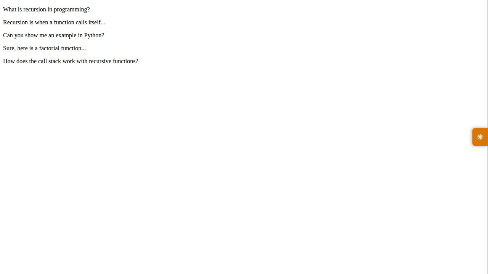 | 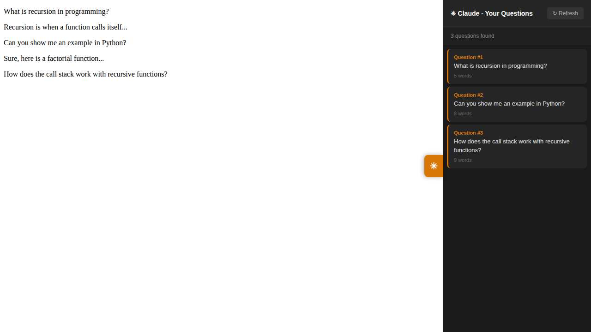 |

### Claude Code — PASS

| Toggle Button | Panel Open |
|:---:|:---:|
| 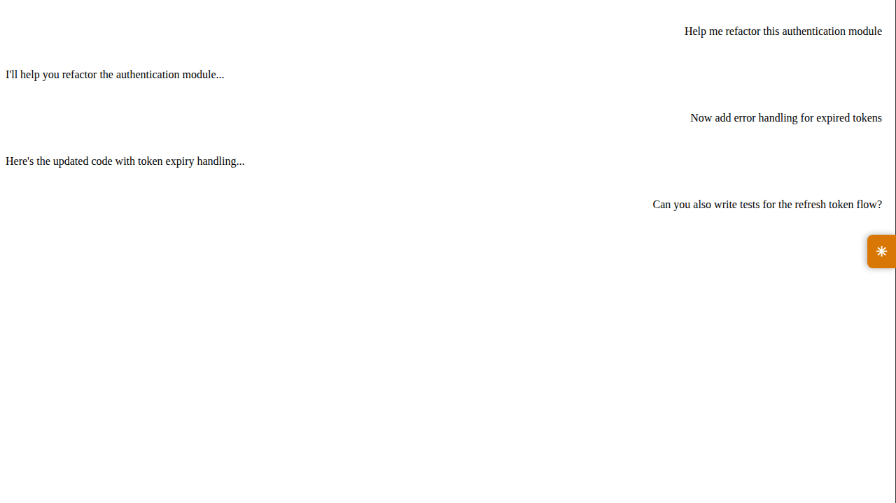 | 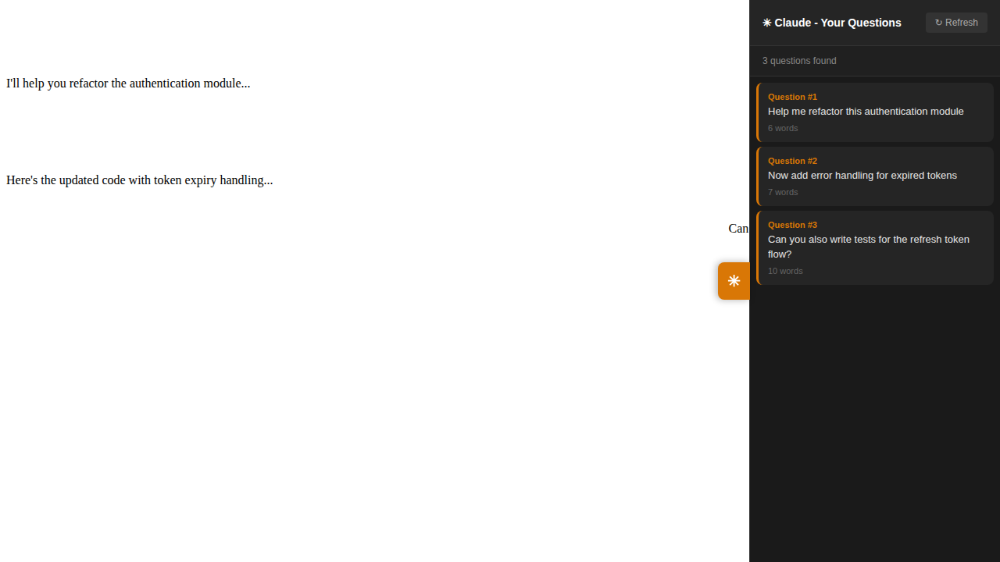 |

### ChatGPT — PASS

| Toggle Button | Panel Open |
|:---:|:---:|
| 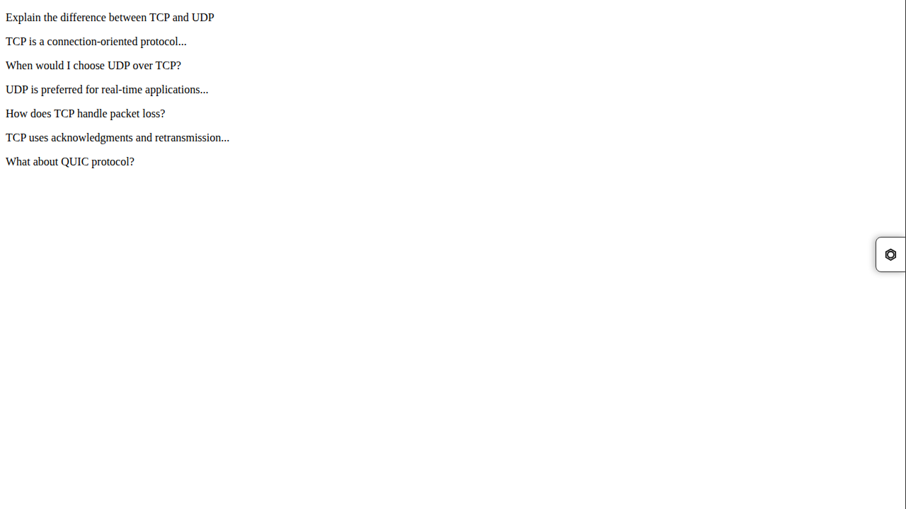 | 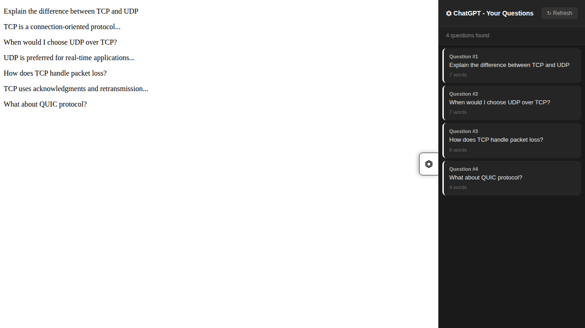 |

### Codex Web — PASS

| Toggle Button | Panel Open |
|:---:|:---:|
| 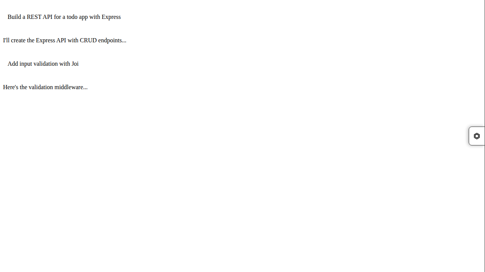 | 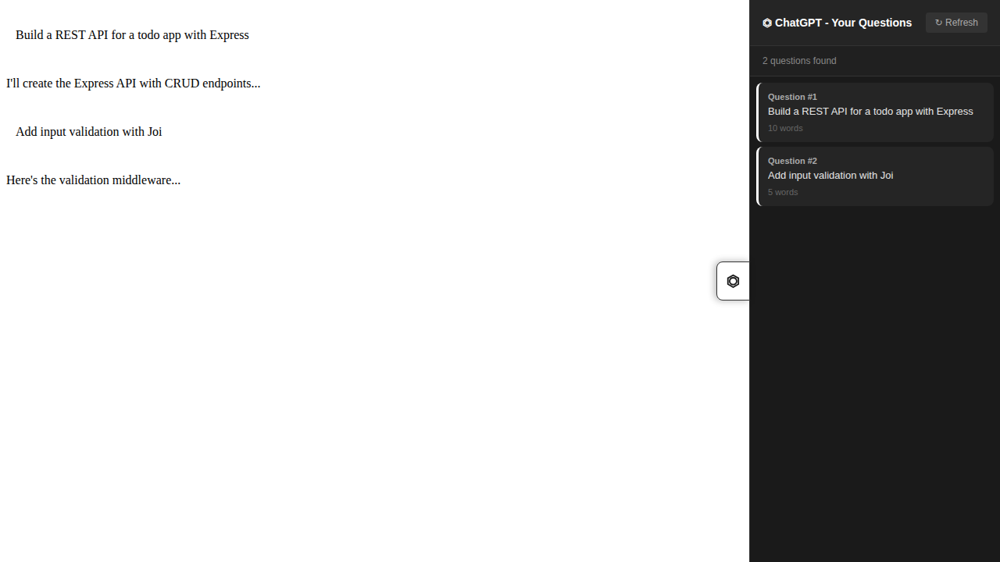 |

### Grok — PASS

| Toggle Button | Panel Open |
|:---:|:---:|
| 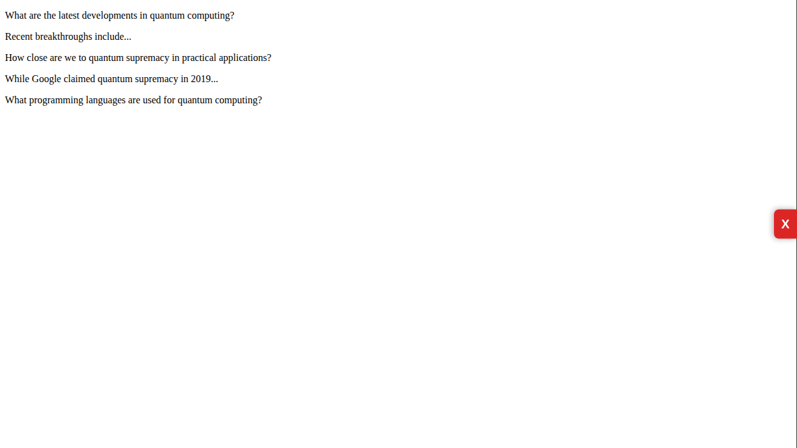 | 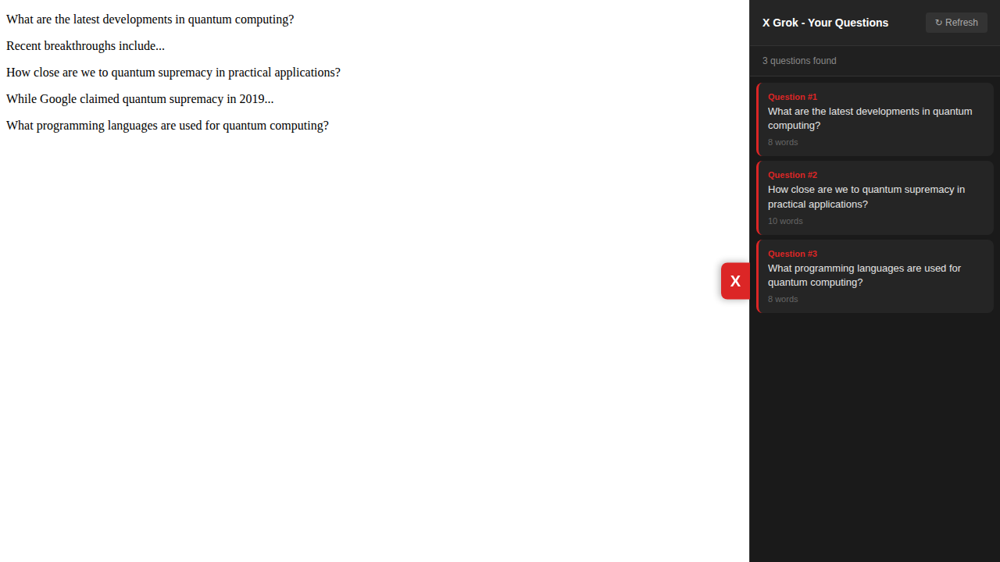 |

### Gemini — PASS

| Toggle Button | Panel Open |
|:---:|:---:|
| 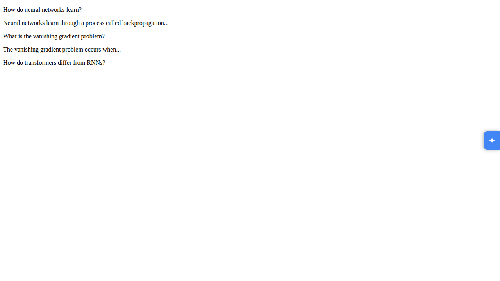 | 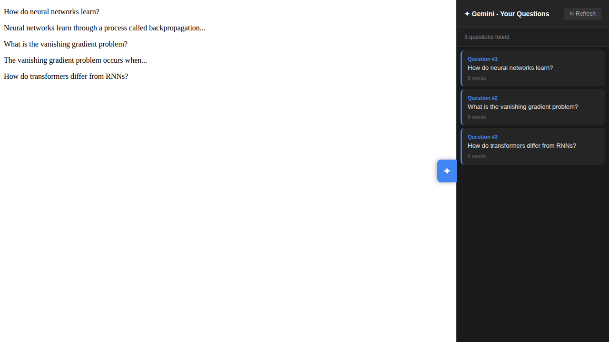 |

### Bolt.new — PASS

| Toggle Button | Panel Open |
|:---:|:---:|
| 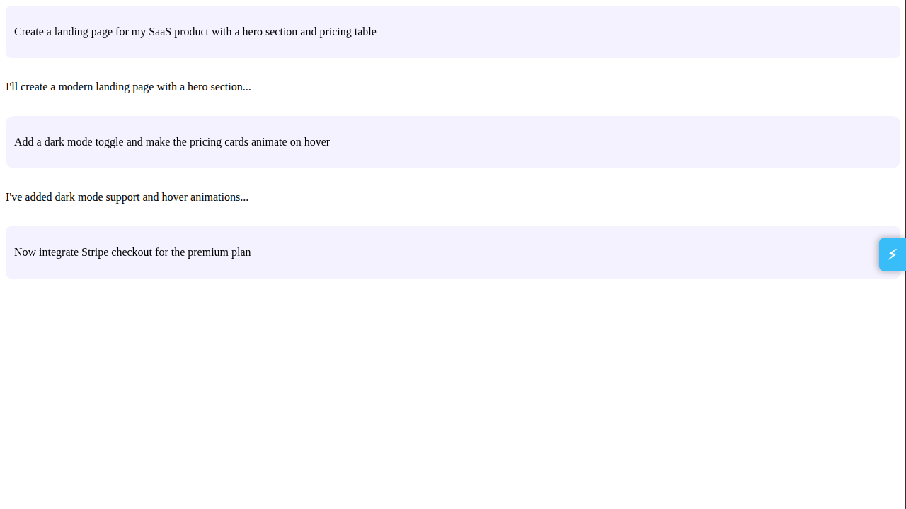 | 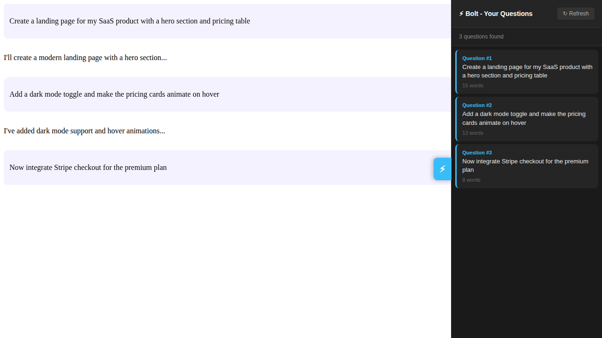 |

### Lovable — PASS

| Toggle Button | Panel Open |
|:---:|:---:|
| 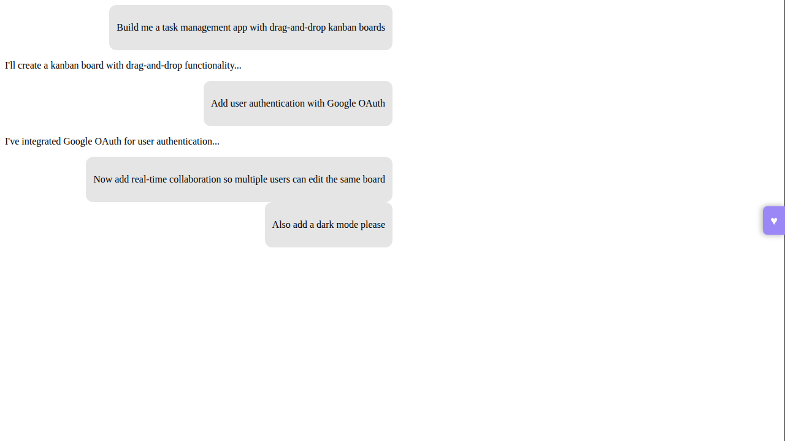 | 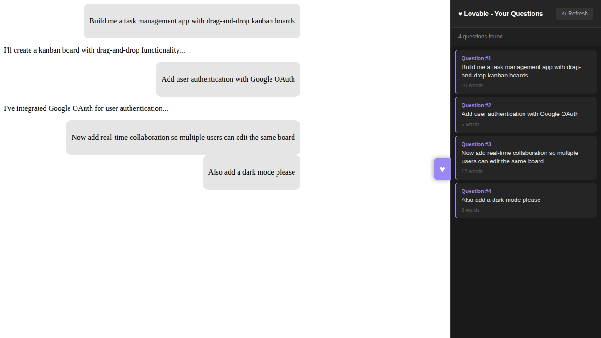 |

### Replit — PASS

| Toggle Button | Panel Open |
|:---:|:---:|
| 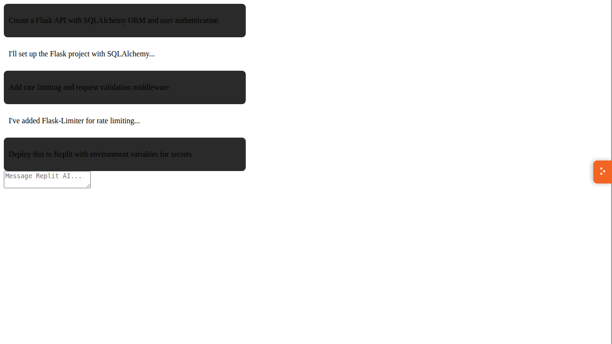 | 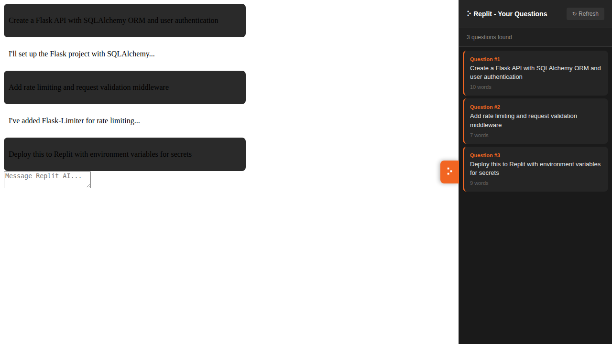 |

